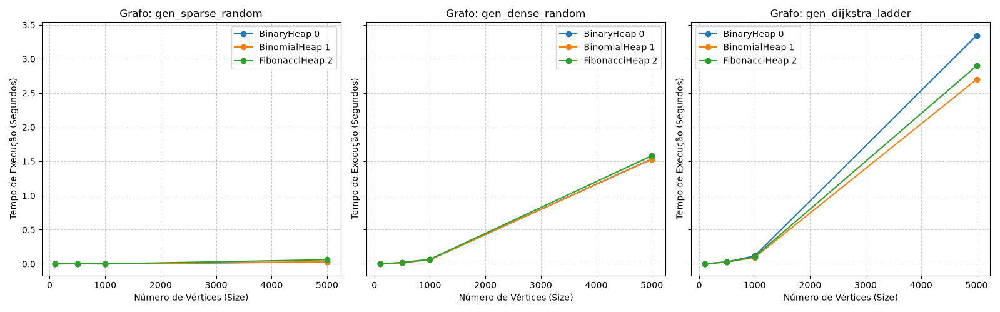
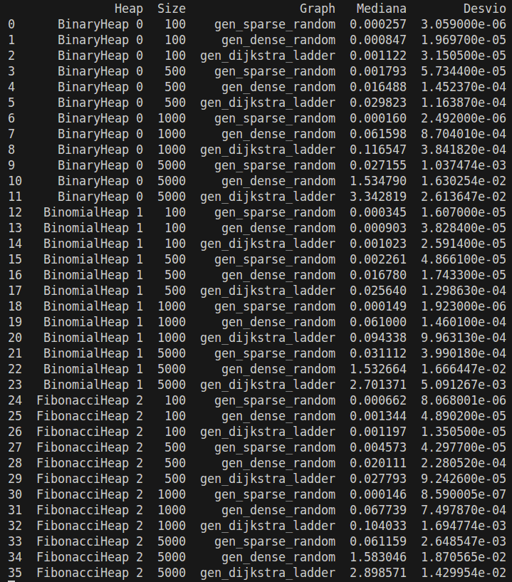

# Relatório experimental

## Ambiente e protocolo

Configurações da máquina utilizada para realizar os testes:
- **Máquina:** `Acer Nitro V15`
- **Processador:** `13th` Gen Intel(R) Core(TM) `i5-13420H` 
- **S.O.:** **`Ubuntu 24.04.5 LTS`**
- **Versão do Python:** **`3.12.3`**
- **Gerador e Semente Pseudoaleatória:** Os grafos foram gerados utilizando o módulo nativo `random` com a semente fixa **`SEED = 2027`** 
- **Relógio de Medição:** `time.perf_counter()` (alta precisão).
- **Protocolo de Medição e Aquecimento (Warm-up):** Para cada combinação de estrutura de dados, família de grafo e tamanho ($N$):
    * **Aquecimento:** Foram realizadas `2 execuções de aquecimento descartadas` (aquecimento = 2) antes do início da coleta de dados. O objetivo do aquecimento é estabilizar o ambiente do interpretador Python e o uso de memória/cache do sistema operacional.
    * **Medição:** Após o aquecimento, coletaram-se `7 medições independentes` (repeticoes = 7) do algoritmo de Dijkstra isolado.
    * **Agregação:** Os dados foram agregados utilizando a Mediana (tendência central) e o Desvio Absoluto Mediano (MAD) (medida de dispersão).

<!-- Descreva máquina, Python, semente, aquecimento e repetições. -->
Os experimentos foram executados em um ambiente controlado com as seguintes especificações de hardware e software:

## Famílias de grafos

As três famílias de grafo utilizadas foram:

- **Grafos Esparsos:** Número de nós e arestas são quase o mesmo;
- **Grafos Densos:** Número de aréstas é aproximadamente o quadrado do número de nós;
- **Grafos "Dijkstra Ladder":** O grafo é construído pensando em explorar a fragilidade do dijkstra que é realmente as inserções e remoções na Heap. 

Os tamanhos utilizados foram:

| | |
|-|-|
| • 100 | • 500 |
| • 1000 | • 5000 |
| | |

<!-- Descreva pelo menos três famílias e quatro tamanhos por família. -->

## Resultados

<!-- Inclua unidades e dispersão. -->

## Discussão

<!-- Relacione resultados, operações dominantes e análise assintótica. -->

## Limitações e ameaças à validade

